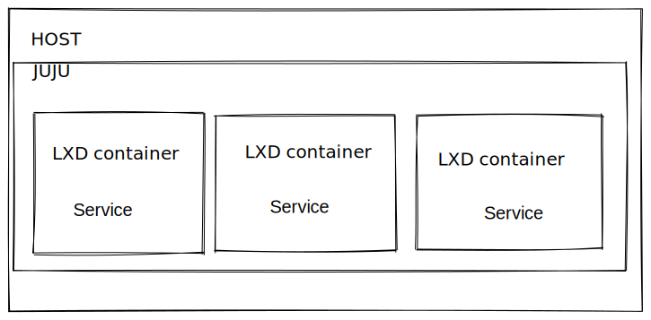

# Deploy JUJU with LXD



Requirement :&#x20;

* CPU 4 core or more
* RAM 4 GB or more

Deploy&#x20;

```
apt update
apt install snap
snap install lxd
snap install juju
lxd init

# integrate juju with lxd 
# exaple: juju bootstrap localhost <name-controller>

juju bootstrap localhost gandalf

# deploy something 

juju deploy mysql
juju deploy mariadb
```
