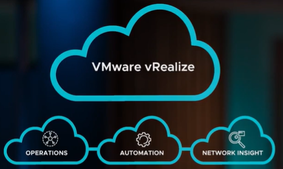

# Introduction to VMware Cloud

<figure><figcaption></figcaption></figure>

its all about having the right architecture. As organizations develop and deliver modern and traditional applications in the cloud, they redefine the nature of IT.

Organizations that use cloud capabilities and technologies to transform their business can reap several benefits:

* Increased agility: Agility encompasses scalability, customizability, and access to the cloud service from anywhere and on any device. In addition, you can have the same level of security regardless of the scale of your business or services.
* Cost reductions: You save on capital expenses (hardware) and can use a flexible payment structure where you pay only for the resources that you use.
* Increased innovation and developer productivity: With cloud computing, organizations do not need to worry about managing IT infrastructures and can focus on application development and other priorities using the most up-to-date technology.

**Cloud Challenges**

Even with all its benefits, the cloud also presents challenges as IT struggles to balance the needs of new and existing applications. Pressure to provide reliability, availability, security, and governance can be compounded by a growing portfolio of application architectures, infrastructure and cloud vendors, tools, and processes.
