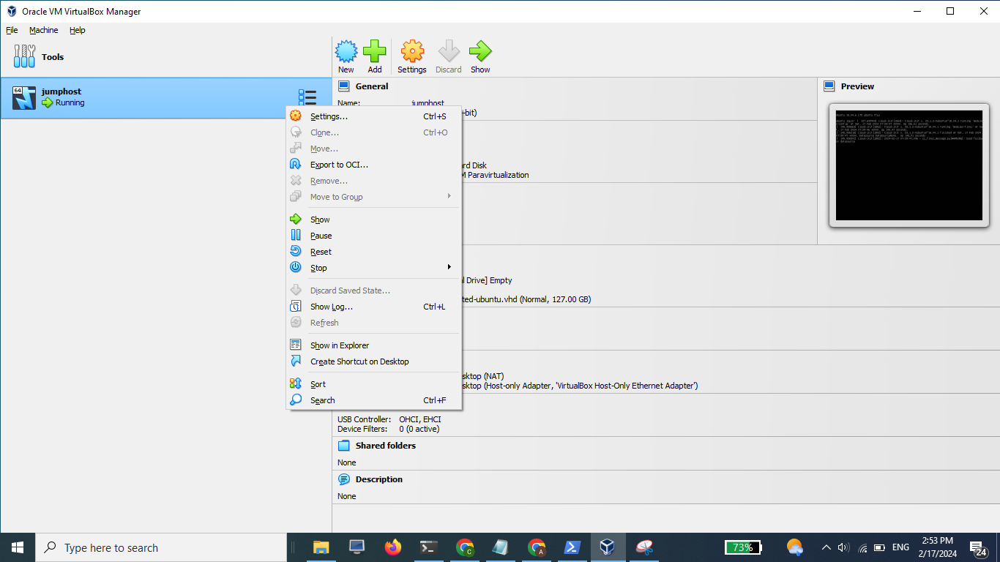

# Autostart VM saat windows bootup

1. buka virtual box, select vm dan klik kanan lalu create shortcut

<figure><figcaption></figcaption></figure>

2. buka shortcut pada tampilan depan dan edit Target , menggunakan perintah berikut. lalu save .

"C:\Program Files\Oracle\VirtualBox\VBoxManage.exe" startvm \<Nama VM> --type=headless

<figure><figcaption></figcaption></figure>

3. lalu pindah file shortcut tersebut ke folder

```
C:\ProgramData\Microsoft\Windows\Start Menu\Programs\StartUp
```

<figure><figcaption></figcaption></figure>

4. coba restart apakah vm sudah otomatis menyala saat windows di hidupkan.
